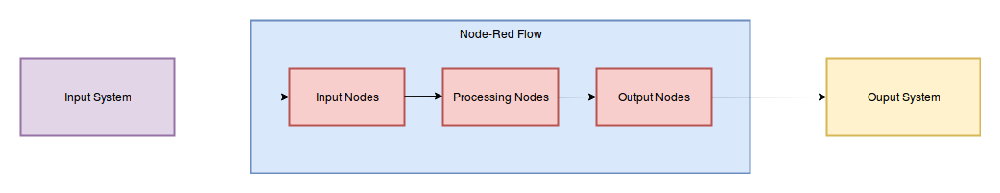

# Node-Red And MEO Project

## 1. Node Red

Source:

- [http://noderedguide.com](http://noderedguide.com)
- [https://nodered.org/docs/getting-started/](https://nodered.org/docs/getting-started/)

Node-RED is a powerful tool for building Internet of Things (IoT) applications with a focus on simplifying the 'wiring together' of code blocks to carry out tasks. It uses a visual programming approach that allows developers to **connect predefined code blocks**, known as 'nodes', together to **perform a task**. The connected nodes, usually a combination of **input nodes, processing nodes and output nodes**, when wired together, make up a **flows**,

Node Red là một công cụ cho phép xây dựng ứng dụng IoT một cách dễ dàng, nhanh chóng và hiệu quả. Để thực hiện được điều này, Node Red cách cung cấp cho người dùng khả năng lập trình trên giao diện trực quan, bằng cách cung cấp cho người dùn một giao diện lập trình bao gồm: một màn hình lập trình có tên là **Dashboard**, và một panel phía bên trái dashboard chứa một danh sách các khối được gọi là các **Node**. Về bản chất bên dưới, một **Node** là một khối code đã được Node-Red định nghĩa sẵn có khả năng thực hiện được một dạng công việc xác định.

Để lập trình bằng giao diện lập trình mà Node Red cung cấp, người dùng sẽ kéo thả các Node mà người dùng cần từ panel vào bên trong Dashboard, sau đó tùy chỉnh các Node theo nhu cầu rồi thực hiện việc kết nối các Node trong Dashboard bằng các dây kết nối theo một trình tự xác định để tạo thành các **flow**.

Một flow là một chuỗi xử lý thông tin được biểu diễn dưới dạng một tập các node được kết nối với nhau theo một thứ tự nào đó, có 3 loại node trong flow:

- input node
- processing node
- output node.

Thông tin từ các hệ thống bên ngoài sẽ được truyền vào flow thông qua input node, rồi đi tới các processing node. Tại các processing node thông tin sẽ được xử lý và biến đổi, sau đó được chuyển tới các output node để truyền tới các hệ thống bên ngoài như là màn hình, hoặc giao diện debug, giao diện web hoặc là truyền vào và lưu trữ trong một database... Sơ đồ xử lý dữ liệu bằng một flow có thể mô tả như sau:



Ví dụ về sơ đồ luồng xử lý dữ liệu của một hệ thống xử lý dữ liệu IoT bằng Node Red flow có thể được mô tả như sau:


Khi một flow được khởi động và thực thi (deploy), các Node trên flow sẽ trở thành thành các JavaScript Object nằm trong Node-Red-Process, và lúc này flow của chúng ta trở thành một IoT Application. Còn flow nằm trên dashboard chỉ là các thể hiện của các Object này lên màn hình giao diện lập trình, để cho phép người dùng thiết lập và tùy chỉnh flow, điều chỉnh kết nối giữa các Object trên flow với nhau. Chính vì điều này nên dù chúng ta có tắt giao diện lập trình của Node-Red đi, thì chương trình IoT của chúng ta vẫn chạy.

Một số ví dụ về Node-Red flow

**Example 1.1 Using Twitter to control a Raspberry PI**


Trong ví dụ này, flow của chúng ta có 3 node: Input Object thu nhận các thông điệp có tag ```#led``` từ twitter, sau đó Input Object này chuyển thông tin tới node **trigger**. Process node - trigger node khi nhận được các thông tin từ Input node gửi tới sẽ có nhiệm vụ gửi các số 1,0 tới Output Node là node có chức năng là Controller điều khiển Raspberry. Output Node nhận các tín hiệu từ Process Node gửi tới, sau đó sử dụng driver Raspberry đã được nhúng sẵn trong node đó để gửi các tín hiệu này qua chân cắm Pin 12 tới mạch (thiết bị) Raspberrry thực và thiết bị Raspberrry khi nhận được tín hiệu sẽ tùy vào nội dung tín hiệu nhận được mà bật/tắt đèn led đang gắn vào nó.

Ví dụ 2:

**Example 1.3 Building a simple web service using Node-RED’s built-in HTTP nodes**


Trong ví dụ này, flow mà chúng ta tạo ra là một Web Server, và 4 node trên flow trên là 4 thành phần của WebServer này, trong đó:

- Node 1 đóng vai trò là module nhận request từ Client gửi tới web server ở URL ```public/{username}/fitbit```. 
- Dữ liệu từ request sẽ được Node 1 gửi  tới module Fibtbit Node có nhiệm vụ lấy dữ liệu liên quan tới sức khỏe của người dùng (online hoặc truy vấn vào cơ sở dữ liệu). Sau đó dữ liệu lấy được được Node 2 gửi tới cho Node3
- Node 3 có nhiệm vụ nhận dữ liệu từ node 2 gửi tới rồi đóng gói/nhúng dữ liệu vào khung html template. Sau đó file html được tạo ra sau quá trình nhúng được gửi tới node 4.
- Node 4 có nhiệm vụ nhận file html được sinh ra từ node 3 và đóng gói file html này vào HTTP response rồi gửi trả về cho Client.

## Node-Red Docker Container with mounted volume

- Node-Red hiện tại đã được đóng gói thành container/images và có thể được download từ docker Hub dưới tên gọi nodered/node-red-docker

```bash
docker pull nodered/node-red-docker
```

- Để run Node-Red Container dưới cổng 1880:

```bash
$sudo docker run -it -p 1880:1880 --name node-red nodered/node-red-docker
$
```

Để node-red container chuyển sang chế độ chạy ngầm (back-ground), sử dụng tổ hợp phím:

```bash
Ctrl-p + Ctrl-q
```

để attach lại node-red container:

```bash
$sudo docker attach mynodered
$
```

### Use Node-Red Container with mounted volume

Node-Red container sử dụng thư mục có đường dẫn là ```/data``` để lưu trữ các flow mà người dùng đã tạo ra, cũng như các thiết lập cho container. Đồng thời Node-Red container ban đầu chỉ cung cấp một tập các Node cơ bản. Nếu người dùng muốn sử dụng các Node khác, Người dùng cần sử dụng câu lệnh ```npm install <node-red-new-node-name>```. Lúc này các node mới sẽ được cài đặt vào chính thư mục data ở thư mục con trong thư mục ```/data``` có tên là ```node_modules```.

Nhưng chúng ta có một vấn đề ở đây. Vì tất cả các dữ liệu của người dùng đều để bên trong thư mục data, do đó khi container bị hủy bỏ, tất cả các dữ liệu mà người dùng đã tạo ra trong thư mục data cũng sẽ mất đi. Để giữ lại các thông tin này (các flow đã tạo ra, các extension-node đã cài đặt, các thiết lập...), chúng ta cần mount thư mục ```/data``` ra một thư mục bên ngoài của host server.

Để làm được điều này, đầu tiên chúng ta cần chuẩn bị thư mục sẽ được ```/data``` mount vào. Đầu tiên, chúng ta sẽ tạo ra thư mục ~/node-red-volume. Chúng ta cần chuẩn bị trong thư mục này các file/folder sau:

```txt
node-red-volume
|
|--lib
|   |--flows
|
|--package.json
|
|--settings.js
```

Trong sơ đồ trên, foler node-red-volume có 2 thư mục lồng là lib và flows, trong đó flows là thư mục rỗng. Có 2 file là package.json và settings.js. Nội dung của 2 file này như sau:

- file **package.json**

```json
{
    "name": "node-red-project",
    "description": "A Node-RED Project",
    "version": "0.0.1"
}
```

- file **settings.js**

```js
/**
 * Copyright JS Foundation and other contributors, http://js.foundation
 *
 * Licensed under the Apache License, Version 2.0 (the "License");
 * you may not use this file except in compliance with the License.
 * You may obtain a copy of the License at
 *
 * http://www.apache.org/licenses/LICENSE-2.0
 *
 * Unless required by applicable law or agreed to in writing, software
 * distributed under the License is distributed on an "AS IS" BASIS,
 * WITHOUT WARRANTIES OR CONDITIONS OF ANY KIND, either express or implied.
 * See the License for the specific language governing permissions and
 * limitations under the License.
 **/

// The `https` setting requires the `fs` module. Uncomment the following
// to make it available:
//var fs = require("fs");

module.exports = {
    // the tcp port that the Node-RED web server is listening on
    uiPort: process.env.PORT || 1880,

    // By default, the Node-RED UI accepts connections on all IPv4 interfaces.
    // The following property can be used to listen on a specific interface. For
    // example, the following would only allow connections from the local machine.
    //uiHost: "127.0.0.1",

    // Retry time in milliseconds for MQTT connections
    mqttReconnectTime: 15000,

    // Retry time in milliseconds for Serial port connections
    serialReconnectTime: 15000,

    // Retry time in milliseconds for TCP socket connections
    //socketReconnectTime: 10000,

    // Timeout in milliseconds for TCP server socket connections
    //  defaults to no timeout
    //socketTimeout: 120000,

    // Timeout in milliseconds for HTTP request connections
    //  defaults to 120 seconds
    //httpRequestTimeout: 120000,

    // The maximum length, in characters, of any message sent to the debug sidebar tab
    debugMaxLength: 1000,

    // To disable the option for using local files for storing keys and certificates in the TLS configuration
    //  node, set this to true
    //tlsConfigDisableLocalFiles: true,

    // Colourise the console output of the debug node
    //debugUseColors: true,

    // The file containing the flows. If not set, it defaults to flows_<hostname>.json
    //flowFile: 'flows.json',

    // To enabled pretty-printing of the flow within the flow file, set the following
    //  property to true:
    //flowFilePretty: true,

    // By default, credentials are encrypted in storage using a generated key. To
    // specify your own secret, set the following property.
    // If you want to disable encryption of credentials, set this property to false.
    // Note: once you set this property, do not change it - doing so will prevent
    // node-red from being able to decrypt your existing credentials and they will be
    // lost.
    //credentialSecret: "a-secret-key",

    // By default, all user data is stored in the Node-RED install directory. To
    // use a different location, the following property can be used
    //userDir: '/home/nol/.node-red/',

    // Node-RED scans the `nodes` directory in the install directory to find nodes.
    // The following property can be used to specify an additional directory to scan.
    //nodesDir: '/home/nol/.node-red/nodes',

    // By default, the Node-RED UI is available at http://localhost:1880/
    // The following property can be used to specifiy a different root path.
    // If set to false, this is disabled.
    //httpAdminRoot: '/admin',

    // Some nodes, such as HTTP In, can be used to listen for incoming http requests.
    // By default, these are served relative to '/'. The following property
    // can be used to specifiy a different root path. If set to false, this is
    // disabled.
    //httpNodeRoot: '/red-nodes',

    // The following property can be used in place of 'httpAdminRoot' and 'httpNodeRoot',
    // to apply the same root to both parts.
    //httpRoot: '/red',

    // When httpAdminRoot is used to move the UI to a different root path, the
    // following property can be used to identify a directory of static content
    // that should be served at http://localhost:1880/.
    //httpStatic: '/home/nol/node-red-static/',

    // The maximum size of HTTP request that will be accepted by the runtime api.
    // Default: 5mb
    //apiMaxLength: '5mb',

    // If you installed the optional node-red-dashboard you can set it's path
    // relative to httpRoot
    //ui: { path: "ui" },

    // Securing Node-RED
    // -----------------
    // To password protect the Node-RED editor and admin API, the following
    // property can be used. See http://nodered.org/docs/security.html for details.
    //adminAuth: {
    //    type: "credentials",
    //    users: [{
    //        username: "admin",
    //        password: "$2a$08$zZWtXTja0fB1pzD4sHCMyOCMYz2Z6dNbM6tl8sJogENOMcxWV9DN.",
    //        permissions: "*"
    //    }]
    //},

    // To password protect the node-defined HTTP endpoints (httpNodeRoot), or
    // the static content (httpStatic), the following properties can be used.
    // The pass field is a bcrypt hash of the password.
    // See http://nodered.org/docs/security.html#generating-the-password-hash
    //httpNodeAuth: {user:"user",pass:"$2a$08$zZWtXTja0fB1pzD4sHCMyOCMYz2Z6dNbM6tl8sJogENOMcxWV9DN."},
    //httpStaticAuth: {user:"user",pass:"$2a$08$zZWtXTja0fB1pzD4sHCMyOCMYz2Z6dNbM6tl8sJogENOMcxWV9DN."},

    // The following property can be used to enable HTTPS
    // See http://nodejs.org/api/https.html#https_https_createserver_options_requestlistener
    // for details on its contents.
    // See the comment at the top of this file on how to load the `fs` module used by
    // this setting.
    //
    //https: {
    //    key: fs.readFileSync('privatekey.pem'),
    //    cert: fs.readFileSync('certificate.pem')
    //},

    // The following property can be used to cause insecure HTTP connections to
    // be redirected to HTTPS.
    //requireHttps: true

    // The following property can be used to disable the editor. The admin API
    // is not affected by this option. To disable both the editor and the admin
    // API, use either the httpRoot or httpAdminRoot properties
    //disableEditor: false,

    // The following property can be used to configure cross-origin resource sharing
    // in the HTTP nodes.
    // See https://github.com/troygoode/node-cors#configuration-options for
    // details on its contents. The following is a basic permissive set of options:
    //httpNodeCors: {
    //    origin: "*",
    //    methods: "GET,PUT,POST,DELETE"
    //},

    // If you need to set an http proxy please set an environment variable
    // called http_proxy (or HTTP_PROXY) outside of Node-RED in the operating system.
    // For example - http_proxy=http://myproxy.com:8080
    // (Setting it here will have no effect)
    // You may also specify no_proxy (or NO_PROXY) to supply a comma separated
    // list of domains to not proxy, eg - no_proxy=.acme.co,.acme.co.uk

    // The following property can be used to add a custom middleware function
    // in front of all http in nodes. This allows custom authentication to be
    // applied to all http in nodes, or any other sort of common request processing.
    //httpNodeMiddleware: function(req,res,next) {
    //    // Handle/reject the request, or pass it on to the http in node by calling next();
    //    // Optionally skip our rawBodyParser by setting this to true;
    //    //req.skipRawBodyParser = true;
    //    next();
    //},

    // The following property can be used to verify websocket connection attempts.
    // This allows, for example, the HTTP request headers to be checked to ensure
    // they include valid authentication information.
    //webSocketVerifyClient: function(info) {
    //    // 'info' has three properties:
    //    //   - origin : the value in the Origin header
    //    //   - req : the HTTP request
    //    //   - secure : true if req.connection.authorized or req.connection.encrypted is set
    //    //
    //    // The function should return true if the connection should be accepted, false otherwise.
    //    //
    //    // Alternatively, if this function is defined to accept a second argument, callback,
    //    // it can be used to verify the client asynchronously.
    //    // The callback takes three arguments:
    //    //   - result : boolean, whether to accept the connection or not
    //    //   - code : if result is false, the HTTP error status to return
    //    //   - reason: if result is false, the HTTP reason string to return
    //},

    // Anything in this hash is globally available to all functions.
    // It is accessed as context.global.
    // eg:
    //    functionGlobalContext: { os:require('os') }
    // can be accessed in a function block as:
    //    context.global.os

    functionGlobalContext: {
        // os:require('os'),
        // octalbonescript:require('octalbonescript'),
        // jfive:require("johnny-five"),
        // j5board:require("johnny-five").Board({repl:false})
    },

    // The following property can be used to order the categories in the editor
    // palette. If a node's category is not in the list, the category will get
    // added to the end of the palette.
    // If not set, the following default order is used:
    //paletteCategories: ['subflows', 'input', 'output', 'function', 'social', 'mobile', 'storage', 'analysis', 'advanced'],

    // Configure the logging output
    logging: {
        // Only console logging is currently supported
        console: {
            // Level of logging to be recorded. Options are:
            // fatal - only those errors which make the application unusable should be recorded
            // error - record errors which are deemed fatal for a particular request + fatal errors
            // warn - record problems which are non fatal + errors + fatal errors
            // info - record information about the general running of the application + warn + error + fatal errors
            // debug - record information which is more verbose than info + info + warn + error + fatal errors
            // trace - record very detailed logging + debug + info + warn + error + fatal errors
            // off - turn off all logging (doesn't affect metrics or audit)
            level: "info",
            // Whether or not to include metric events in the log output
            metrics: false,
            // Whether or not to include audit events in the log output
            audit: false
        }
    }
}
```

Sau đó, chúng ta có thể run node-red container và mount thư mục /data trong node-red container vào thư mục ~/node-red-volume bên ngoài host bằng câu lệnh sau:

```bash
$sudo docker run -it -p 1880:1880 -v ~/node-red-volume:/data --name node-red nodered/node-red-docker
$
```

Đề cài đặt các node mới vào node-red-container này, trước tiên chúng ta cần cài đặt node-js và npm lên host, sau đó di chuyển working directory tới thư mục node-red-volume rồi tiến hành cài đặt như với trường hợp container không mount volume:

```bash
~/node-red-volume$npm install <node-red-new-node-name>
```

Với node-red container được mount volume, thì kể cả sau khi container bị hủy bỏ, thì các node mà người dùng đã cài đặt cũng như các flow của người dùng đã tạo ra vẫn sẽ được giữ lại trong thư mục ```~/node-red-volume```.

## Các loại node cơ bản trong Node-Red

Node Red có một số loại node cơ bản được liệt kê trong bảng ở link sau:

<http://noderedguide.com/node-red-lecture-4-a-tour-of-the-core-nodes/>

(Các node này đã được người viết thử nghiệm theo các tutorial từ trang web  [http://noderedguide.com/](http://noderedguide.com/) )

## Node-Red Log

Để xem các nội dung log do Node-Red tạo ra (cũng như các nội dung do các câu lệnh console.log() bên trong các node xuất ra), chúng ta có 2 cách:

- Attach vào node-red container thông qua câu lệnh ```sudo docker attach <node-red-container-name>```
- Xem container log bằng câu lệnh ```docker logs <node-red-container-name>```

Để lưu log ra file: ```docker logs <node-red-container-name> >> log.txt```

## MEO Project

Hiện tại, MEO Project là một tập các Input Node, Processing Node và Output node cho phép nhận tín hiệu từ board mạch ESP-8266 bằng một số loại Input node, xử lý dữ liệu nhận được, sau đó chuyển ra các hệ thống bên ngoài bằng Output Node

## Kết nối (linking) Node-Red Container với Message Queue Broker Container

[](https://hub.docker.com/r/nodered/node-red-docker/#Linking-Containers)